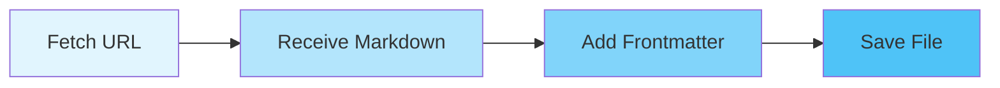

# 📚 Claude Code Documentation Tracker

[日本語](README.ja.md)

[](https://github.com/oikon48/cc-doc-tracker/actions/workflows/fetch-docs.yml)
[](https://opensource.org/licenses/MIT)
[](https://nodejs.org)
[](https://www.typescriptlang.org/)

> Automatically fetch and track changes in Claude Code's official documentation using Git-based scraping.

## ✨ Highlights

**Major Improvement (November 2025):**
- 🎯 **Removed unnecessary HTML processing** (cheerio, turndown)
- 📝 **Server returns pure Markdown** - we now save it directly
- ✅ **Result:** Perfect Markdown readability (no more escaped symbols!)

## 🎯 Features

- 🔄 **Automated Updates**: Twice daily (9:00, 21:00 JST)
- 📝 **Pure Markdown**: Direct storage without HTML conversion
- 📊 **Git-based Tracking**: Complete change history via commits
- 🚀 **TypeScript**: Type-safe, maintainable codebase
- ⚡ **Parallel Processing**: Efficient batch fetching (5 docs concurrently)
- 🔁 **Retry Logic**: Resilient to temporary failures (3 retries with exponential backoff)

## 🏗️ Architecture

### Why So Simple?

This project was significantly simplified after discovering that:

1. Claude Code docs server returns `Content-Type: text/markdown`
2. No HTML parsing needed → **cheerio removed** ✂️
3. No HTML-to-Markdown conversion needed → **turndown removed** ✂️



### Before vs After

| Aspect | Before (Initial) | After (Current) |
|--------|-----------------|-----------------|
| **Dependencies** | node-fetch + cheerio + turndown | node-fetch only |
| **Processing** | Fetch → Parse HTML → Convert → Save | Fetch → Save |
| **Markdown Quality** | Escaped symbols (`\#`, `\*`, `\[`) | Clean Markdown |
| **Code Complexity** | HTML processing logic | Simple direct save |
| **Performance** | Slower (HTML parsing) | Faster (direct write) |

### Example Output Improvement

**Before:**
```markdown
\# Claude Code overview
\* An AWS account with Bedrock access enabled
\[Amazon Bedrock console\](https://console.aws.amazon.com/bedrock/)
```

**After:**
```markdown
# Claude Code overview
* An AWS account with Bedrock access enabled
[Amazon Bedrock console](https://console.aws.amazon.com/bedrock/)
```

## 📁 Directory Structure

```
cc-doc-tracker/
├── docs/en/                # 📄 Fetched Markdown documents
│   ├── overview.md
│   ├── quickstart.md
│   └── ... (45 successfully fetched)
├── metadata/
│   ├── docs_map.md        # 🗺️ Document index from Claude Code
│   └── last_update.json   # 📊 Fetch statistics
├── src/
│   ├── lib/
│   │   └── doc-fetcher.ts # 🎯 Core fetcher (simplified!)
│   ├── fetch-docs.ts      # 🚀 CLI entry point
│   └── index.ts
└── .github/workflows/
    └── fetch-docs.yml     # 🤖 GitHub Actions automation
```

## 🚀 Quick Start

### Prerequisites

- Node.js 18+
- Git
- npm or yarn

### Installation & Usage

```bash
# Clone repository
git clone https://github.com/oikon48/cc-doc-tracker.git
cd cc-doc-tracker

# Install dependencies
npm install

# Fetch documentation
npm run fetch-docs
```

### Development Commands

```bash
npm run dev          # Run with tsx (development mode)
npm run build        # Compile TypeScript
npm run type-check   # Type checking only
npm run lint         # Run ESLint
npm run format       # Format with Prettier
```

## 📊 Tracking Changes

### View Commit History

```bash
# All documentation updates
git log --oneline --grep="📝 Update Claude Code docs"

# Specific file history
git log --follow docs/en/overview.md

# View changes in a commit
git show [commit-hash]
```

### Compare Changes Over Time

```bash
# Yesterday to today
git diff 'HEAD@{yesterday}' HEAD -- docs/

# Specific date range
git diff 'HEAD@{2025-11-01}' 'HEAD@{2025-11-15}' -- docs/

# Last week's changes
git diff 'HEAD@{1 week ago}' HEAD -- docs/
```

### Find Changed Files

```bash
# Latest commit changes
git diff-tree --no-commit-id --name-only -r HEAD

# Changed files in last 7 days
git diff --name-only 'HEAD@{7 days ago}' HEAD -- docs/
```

## 📈 Metadata & Statistics

Fetch statistics are saved in `metadata/last_update.json`:

```json
{
  "lastMapUpdate": "2025-11-06 00:10:13 UTC",
  "lastRun": "2025-11-15T09:31:36.510Z",
  "totalDocs": 46,
  "successfulFetch": 45,
  "failedFetch": 1,
  "failedFiles": ["migration-guide.md"]
}
```

**Current Success Rate:** 97.8% (45/46 documents)

## 🤖 GitHub Actions

### Automated Schedule

The workflow runs automatically:
- **9:00 JST** (0:00 UTC) - Morning update
- **21:00 JST** (12:00 UTC) - Evening update

### Manual Trigger

You can also trigger the workflow manually:

1. Go to [Actions tab](https://github.com/oikon48/cc-doc-tracker/actions)
2. Select "Fetch Claude Code Documentation"
3. Click "Run workflow"

### Workflow Features

- ✅ Automatic issue creation on failure
- ✅ Detailed commit messages with file changes
- ✅ Only commits when changes are detected
- ✅ Comprehensive error reporting

## 🛠️ Technical Stack

### Current Dependencies

```json
{
  "dependencies": {
    "node-fetch": "^3.3.2",  // HTTP client
    "dotenv": "^16.3.1"      // Environment variables
  }
}
```

### Removed Dependencies (as of November 2025)

These packages were removed after discovering the server returns pure Markdown:

- ❌ ~~`cheerio`~~ - HTML parsing (unnecessary)
- ❌ ~~`turndown`~~ - HTML-to-Markdown conversion (unnecessary)
- ❌ ~~`@types/turndown`~~ - TypeScript types (unnecessary)

### Development Tools

- TypeScript 5.3
- ESLint + Prettier
- tsx (TypeScript execution)

## 🤝 Contributing

Issues and Pull Requests are welcome! This project values simplicity and maintainability.

### Development Workflow

1. Fork this repository
2. Create a feature branch
   ```bash
   git checkout -b feature/amazing-feature
   ```
3. Commit your changes
   ```bash
   git commit -m 'Add amazing feature'
   ```
4. Push to the branch
   ```bash
   git push origin feature/amazing-feature
   ```
5. Open a Pull Request

### Contribution Guidelines

- Keep the codebase simple and readable
- Add tests for new features
- Update documentation as needed
- Follow the existing code style

## 🐛 Troubleshooting

### Common Issues

#### Fetch Fails
- **Check network connectivity**
- **Verify Claude Code docs server status** at https://code.claude.com/docs/
- **Review error details** in `metadata/last_update.json`

#### GitHub Actions Fails
- **Check workflow logs** in the [Actions tab](https://github.com/oikon48/cc-doc-tracker/actions)
- **Verify repository permissions** (needs `contents: write`)
- **Check for auto-created issues** (created on failure)

#### TypeScript Build Errors
```bash
# Clean build
rm -rf dist/
npm run build
```

## 📝 License

MIT License - See [LICENSE](LICENSE) for details.

## 🙏 Acknowledgments

- [Claude Code](https://code.claude.com/) - Anthropic's official Claude IDE
- Inspired by [Git Scraping](https://simonwillison.net/2020/Oct/9/git-scraping/) concept by Simon Willison

## ⚠️ Disclaimer

This is an **unofficial** tool and is not affiliated with Claude Code or Anthropic. Documentation copyright belongs to Anthropic.

## 📧 Contact

For questions, suggestions, or issues:
- Open an [Issue](https://github.com/oikon48/cc-doc-tracker/issues)
- Submit a [Pull Request](https://github.com/oikon48/cc-doc-tracker/pulls)

## 📊 Project Stats

- **Documentation Pages Tracked:** 45/46
- **Update Frequency:** Twice daily
- **Technology:** Pure TypeScript with minimal dependencies
- **Simplified in:** November 2025

---

**Last updated:** 2025-11-15

<p align="center">
  Made with ❤️ for the Claude Code community
</p>